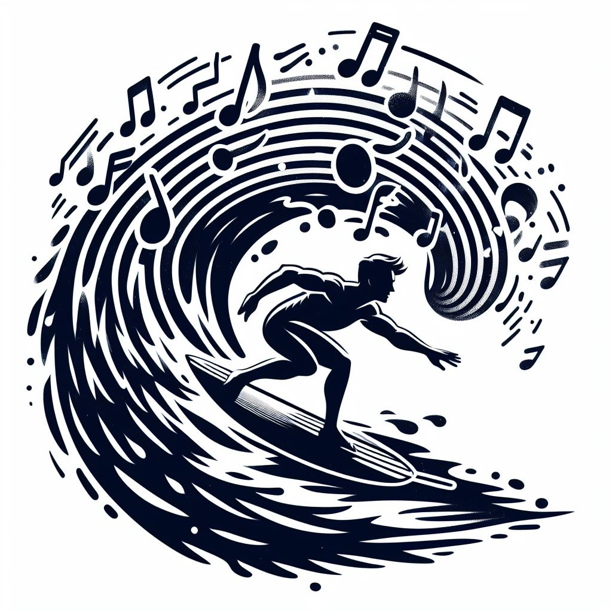
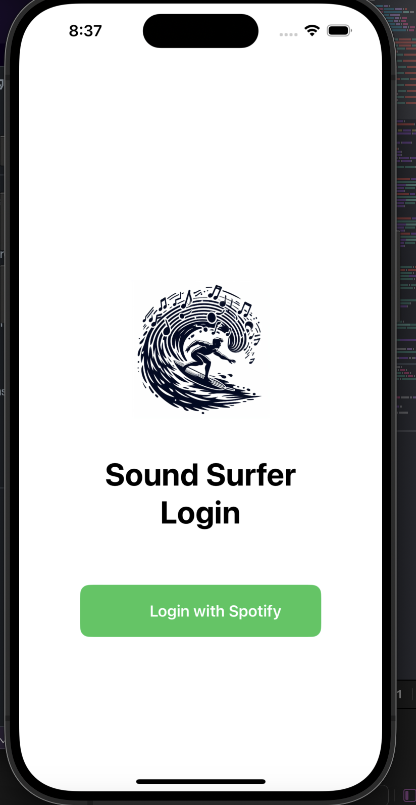
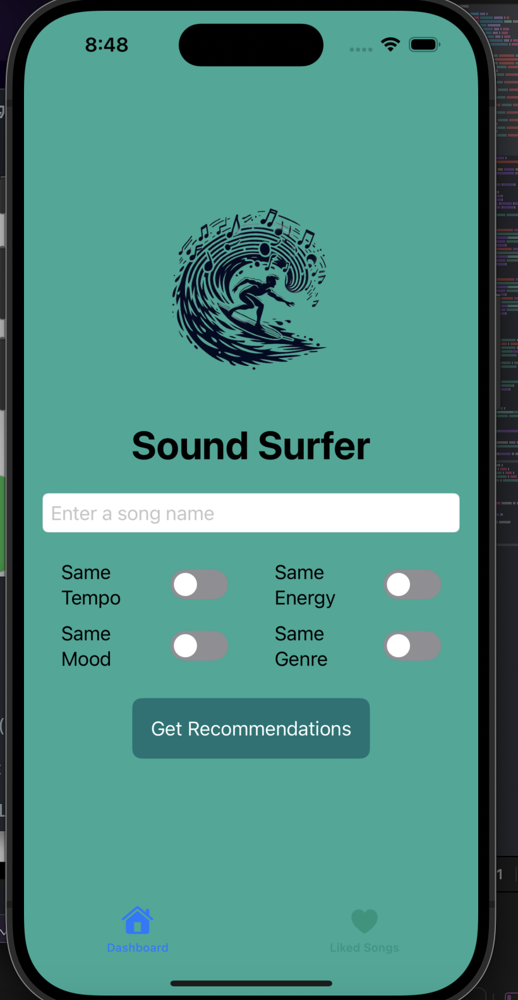
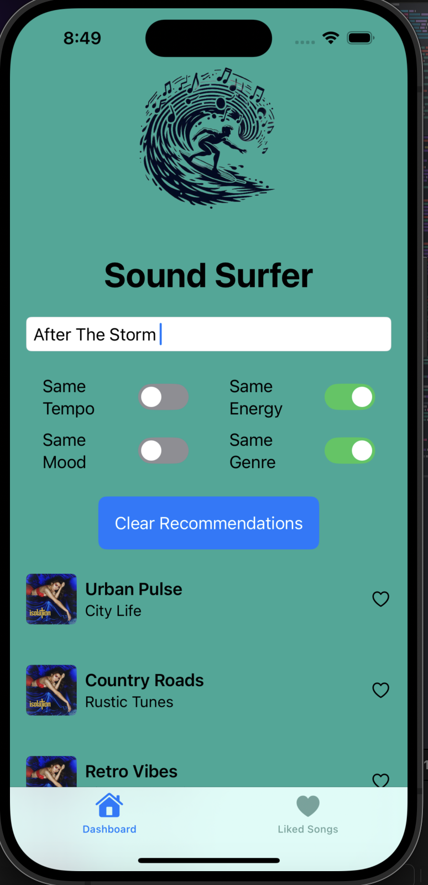
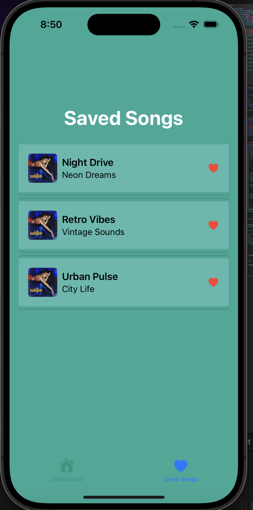

# SoundSurfer iOS App

## Overview

SoundSurfer is an innovative iOS application designed to enhance music discovery. Find songs similar to your favorite song. Users can enter a song name, apply various filters, and generate a personalized 12 song playlist. The app aims to provide a unique, customizable listening experience, allowing users to explore new music that aligns with their preferences.

## Features

- **Song Search**: Users can search for songs by name to start their music discovery journey.
- **Playlist Generation**: Apply filters such as tempo, mood, energy, and genre to generate a tailored playlist based on the song's features.
- **Liked Songs**: Users can save their favorite tracks and view them in the LikedSongs View list. Songs can be managed with custom interactions like liking and unliking.
- **Custom UI**: Features a custom color scheme and logo, enhancing the visual appeal and user experience. Includes a unique toggle style for filter options.
- **Toggle Management**: Ensures that no more than two filters can be active at the same time to streamline the music discovery process.
- **Animated Splash Screen**: Features a dynamic splash screen on login, enhancing the initial user experience and providing a smooth transition into the app.

## Technologies Used

- **SwiftUI**: For building the user interface.
- **Xcode**: As the development environment.
- **GitHub**: For version control and collaboration.

# Developers: Swift Sorcerers

- Abel Mendoza
- Akshat Javiya
- Harry Dinh
- Matthew Hang

## Getting Started

### Prerequisites

- macOS Catalina or later
- Xcode 11 or later
- Swift 5 or later
- An active Apple Developer account for running on a physical device

## Usage

After launching the app, you'll be greeted by the login screen. Use the login functionality to access the main features of the app:

- **Login Screen**: The entry point of the app featuring an animated splash screen.

  
- **Dashboard - Before Recommendations**: View the dashboard before generating recommendations.

  
- **Dashboard - After Recommendations**: View the dashboard after recommendations have been generated.

  
- **Liked Songs**: Manage your list of liked songs from the generated playlists.

  

## Installation

1. **Clone the repository:
   `git clone https://github.com/abelxmendoza/SoundSurferIOS-FrontEnd.git`**
2. **Open the project in Xcode:**

- Navigate to the cloned directory and open the `SoundSurferIOS.xcodeproj` file.

3. **Run the project:**

- Select an iOS simulator or connect a physical iOS device.
- Hit the `Run` button in Xcode to build and run the app.

## Contributing

Contributions to SoundSurfer are welcome! Here's how you can contribute:

1. Fork the project.
2. Create your feature branch (`git checkout -b feature/AmazingFeature`).
3. Commit your changes (`git commit -m 'Add some AmazingFeature'`).
4. Push to the branch (`git push origin feature/AmazingFeature`).
5. Open a pull request.

## License

Distributed under the MIT License. See `LICENSE` for more information.

## Documentation

### Overview

This section provides additional resources that document the development process and demonstrate the functionality of the SoundSurfer iOS app. You'll find links to our video presentation which includes a walkthrough of the app, and our slide deck which outlines the project in detail.

### Video Presentation

Watch our detailed video presentation to see SoundSurfer in action and to understand the thought process behind our design and development choices. The video covers everything from initial design concepts to the final implementation and future development plans.

[Youtube Video Presentation](https://youtu.be/uabpZ_9gjGY)

### Google Slides Presentation

For a more detailed breakdown of the project, including insights into the technical architecture, challenges faced, solutions implemented, and a glimpse into future updates, view our Google Slides presentation.

[Google Slides Presentation](https://docs.google.com/presentation/d/1Zdu8VFeA90NzPOVMjT34gcm4MFY_kKME9NPLPWLm2WM/edit?pli=1#slide=id.p)

## Acknowledgments

- Professor Disha Patel - We express our gratitude to Professor Disha Patel at California State University for her guidance in Swift and iOS development.
